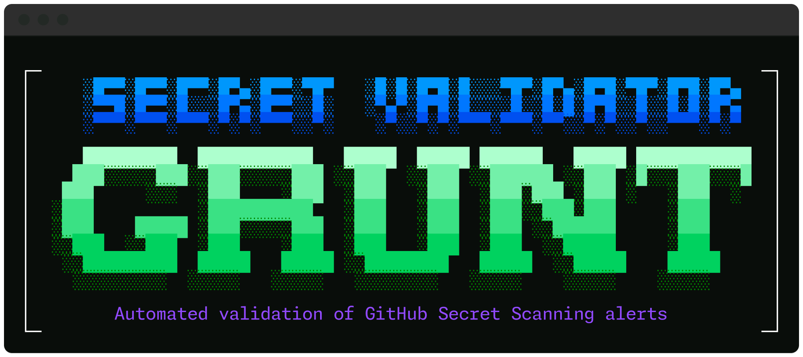

# secret-validator-grunt



Agentic framework for automated validation of GitHub Secret Scanning alerts using Copilot SDK.

## Overview

This app addresses the challenge of efficiently triaging and validating secret scanning alerts at scale. It orchestrates concurrent Agentic validation sessions, produces structured reports with confidence scoring, and uses an LLM-as-judge mechanism to select the best result.

### Key Features

- **Concurrent Analysis**: Run multiple validation agents in parallel
- **Structured Reporting**: Generates evidence based reports with confidence scoring
- **LLM Judge**: Automatically selects the most complete and accurate analysis
- **GitHub Integration**: Fetches alert details and repository context via GitHub APIs

## Requirements

- Python 3.11+
- Copilot CLI
- GitHub token

## Setup

```bash
uv venv
uv sync --extra dev
cp .env.example .env  # configure your environment
```

## Usage

```bash
uv run secret-validator-grunt run org/repo alert_id
```

Reports by default are saved to `analysis/<org>/<repo>/<alert_id>/`

## Development

```bash
uv run pytest          # run tests
uv run yapf -ir src    # format code
```
